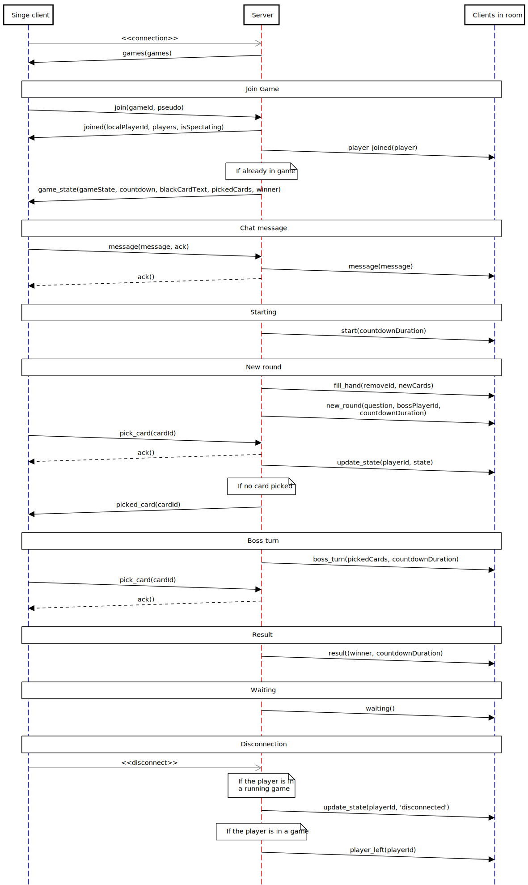

# Limite Limite game server
An unofficial NodeJS game server to play the famous game of cards *Limite Limite*/*Cards Agains Humanity*.

I'm not associated with any providers, this is a personnal project.

# Use
As this is a server implementation only, you won't find any interface for the moment. 
So you might want to create one for you in the `web` directory.

As I'm not licensed to distribute any cards, you'll have to add your owns in the `server/cards` directory.

Then, you can install and start the application with the following commands :

```shell
npm install --only=prod
npm start
```

# Protocol


To update the protocol image, use [this file](./docs/protocol.txt).